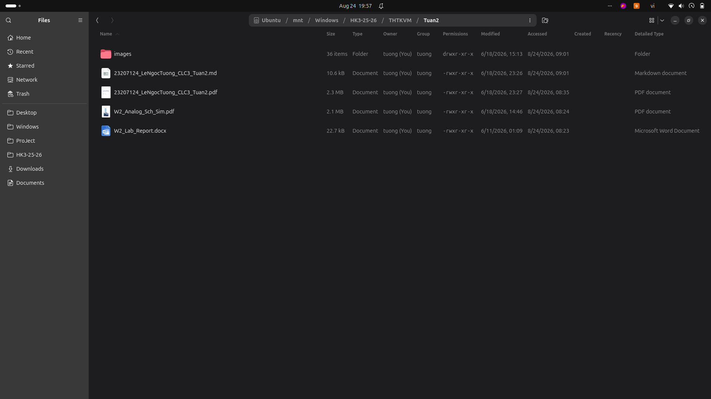
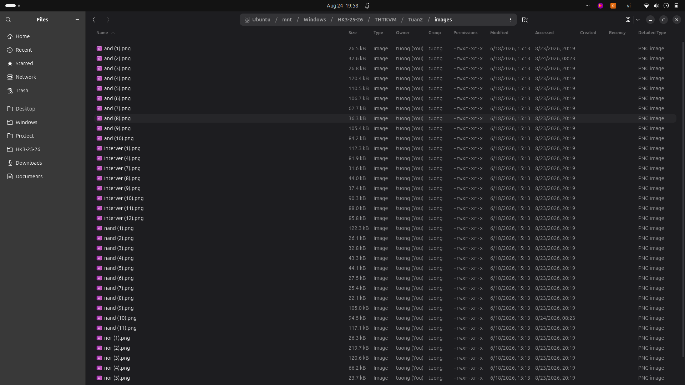

# Tuần 2: Môi trường EDA và Layout PDK 90nm

Sinh viên: Lê Ngọc Tường (MSSV: 23207124, Lớp: 23DTV_CLC3)

## Nội dung thực hiện
- Cấu hình thư viện công nghệ SAED 90nm PDK.
- Khảo sát các quy chuẩn kích thước tối thiểu (Design Rules) của tiến trình 90nm.
- Vẽ sơ đồ nguyên lý và layout cho các cổng logic Inverter, NAND, NOR, AND.
- Chạy mô phỏng quá độ (Transient Analysis) trên phần mềm EDA.

## Danh mục tài liệu
- Báo cáo chi tiết: [BaoCao_ChiTiet_Tuan2.md](./BaoCao_ChiTiet_Tuan2.md) và [23207124_LeNgocTuong_CLC3_Tuan2.pdf](./23207124_LeNgocTuong_CLC3_Tuan2.pdf).
- File đề bài và mẫu báo cáo gốc: W2_Analog_Sch_Sim.pdf, W2_Lab_Report.docx.
- Toàn bộ 36 ảnh chụp màn hình trong quá trình làm bài được lưu trong thư mục [Images_Goc/](./Images_Goc/).
- File log ghi nhận quá trình trích xuất từ database: [Logs/Bang_Chung_Log.txt](./Logs/Bang_Chung_Log.txt).

## Hình ảnh minh họa

### Giao diện môi trường và thư viện PDK 90nm

### Kiểm tra cấu trúc layout

