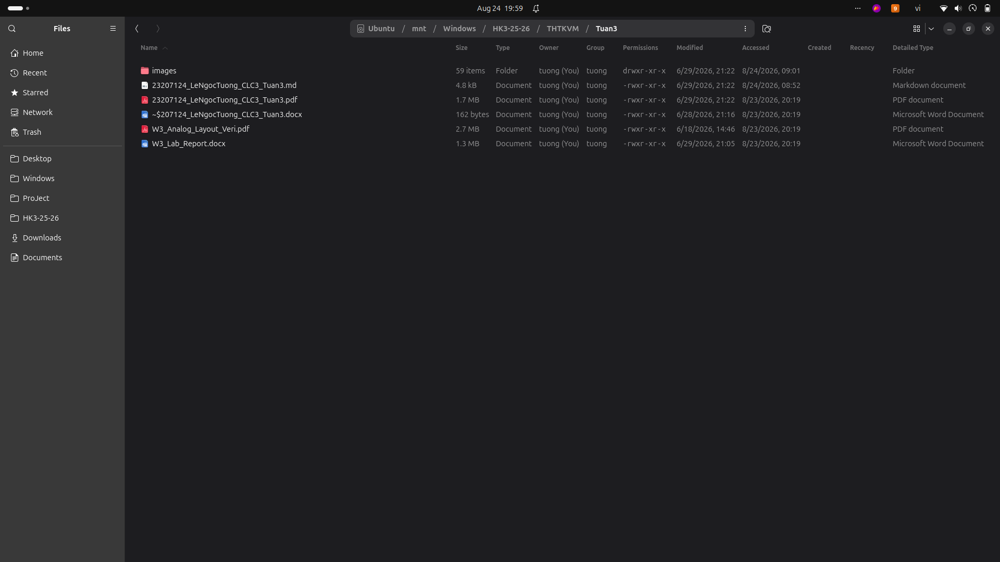
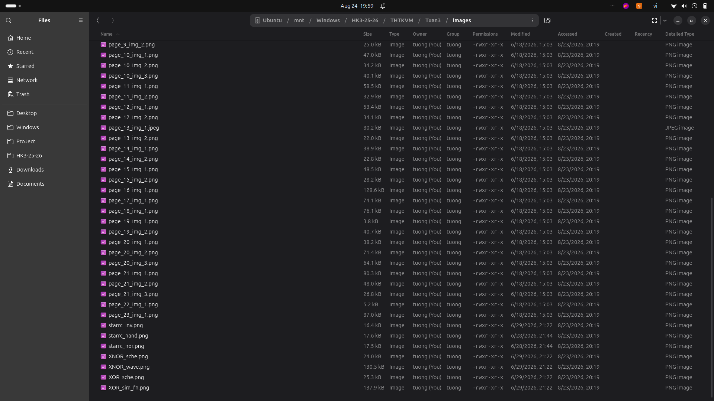
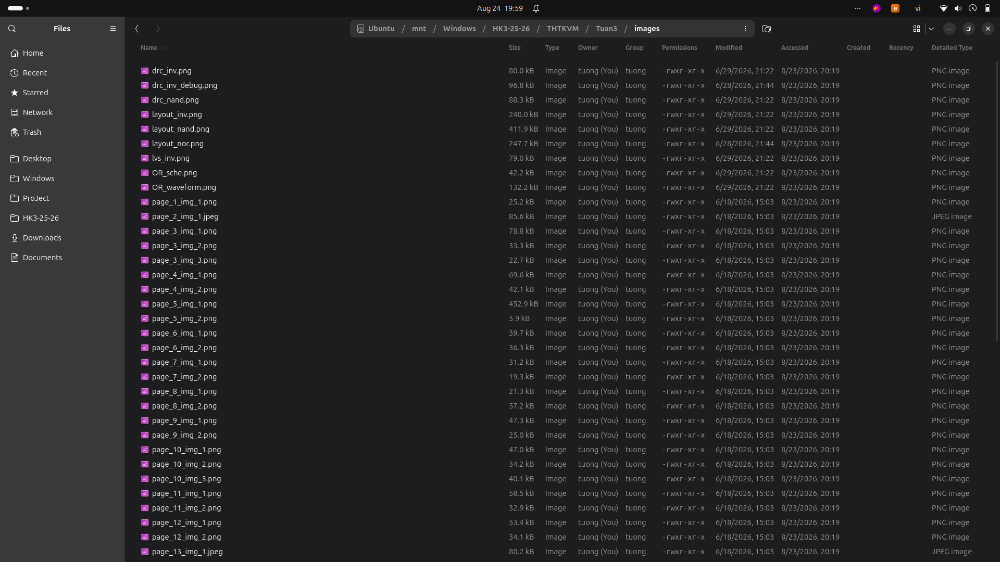

# Tuần 3: Vẽ sơ đồ nguyên lý (Schematic) mạch logic cơ bản

Sinh viên: Lê Ngọc Tường (MSSV: 23207124, Lớp: 23DTV_CLC3)

## Nội dung thực hiện
- Vẽ sơ đồ nguyên lý cho các cổng logic cơ bản và các mạch XOR, XNOR, OR, Inverter trên phần mềm EDA.
- Kiểm tra kết nối chân linh kiện, gán thông số kích thước transistor (W/L) và mô phỏng kiểm tra chức năng logic.

## Danh mục tài liệu
- Báo cáo chi tiết: [BaoCao_ChiTiet_Tuan3.md](./BaoCao_ChiTiet_Tuan3.md) và [23207124_LeNgocTuong_CLC3_Tuan3.pdf](./23207124_LeNgocTuong_CLC3_Tuan3.pdf).
- Tài liệu hướng dẫn: W3_Analog_Layout_Veri.pdf, W3_Lab_Report.docx.
- Toàn bộ ảnh chụp sơ đồ nguyên lý và dạng sóng mô phỏng được lưu trong thư mục [Images_Goc/](./Images_Goc/).

## Hình ảnh minh họa

### Thiết kế sơ đồ nguyên lý

### Kiểm tra kết nối linh kiện

### Dạng sóng mô phỏng ban đầu

