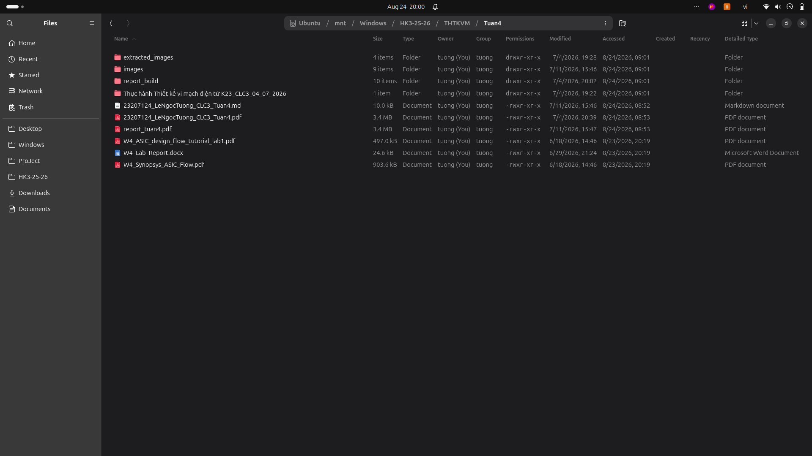
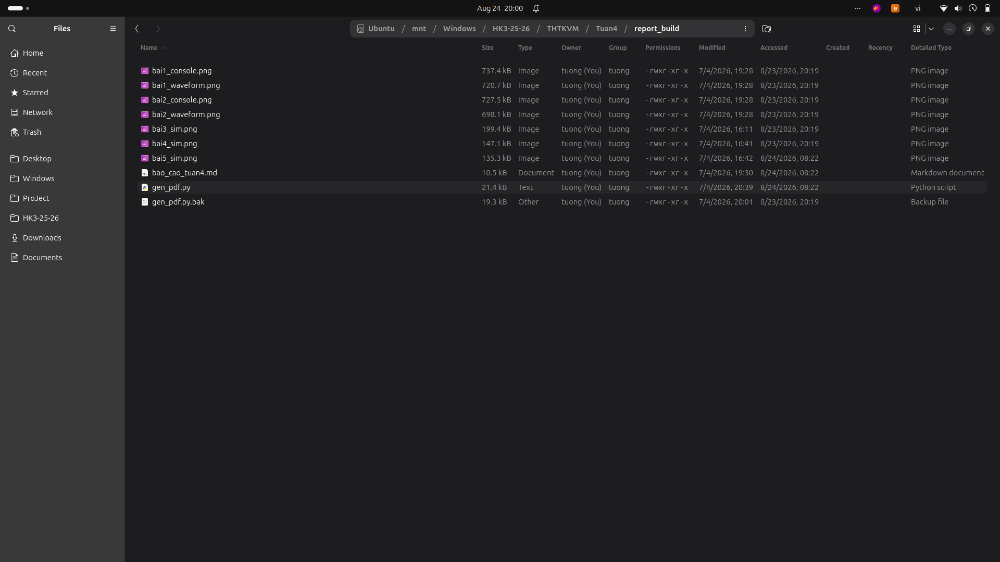
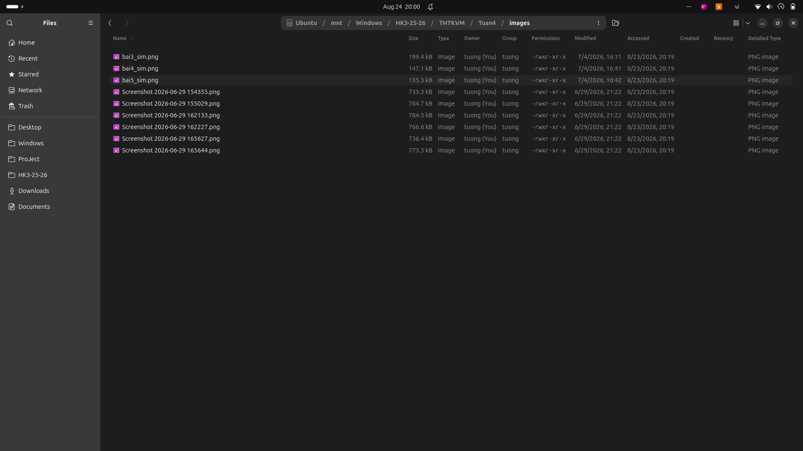

# Tuần 4: Thiết kế layout vật lý mạch logic và kiểm tra DRC, LVS

Sinh viên: Lê Ngọc Tường (MSSV: 23207124, Lớp: 23DTV_CLC3)

## Nội dung thực hiện
- Thiết kế layout vật lý cho các cổng logic từ schematic đã hoàn thiện.
- Chạy kiểm tra luật thiết kế (DRC) và kiểm tra tương đương sơ đồ nguyên lý với layout (LVS).
- Sửa các lỗi vi phạm khoảng cách lớp kim loại (Metal), vùng khuếch tán (Diffusion) và chạy lại cho đến khi pass LVS.

## Danh mục tài liệu
- Báo cáo chi tiết: [BaoCao_ChiTiet_Tuan4.md](./BaoCao_ChiTiet_Tuan4.md) và [23207124_LeNgocTuong_CLC3_Tuan4.pdf](./23207124_LeNgocTuong_CLC3_Tuan4.pdf).
- Script tạo báo cáo và ảnh build: thư mục report_build/ và extracted_images/.
- Toàn bộ ảnh chụp màn hình kiểm tra DRC/LVS lưu trong thư mục [Images_Goc/](./Images_Goc/).
- Tài liệu hướng dẫn: W4_ASIC_design_flow_tutorial_lab1.pdf, W4_Synopsys_ASIC_Flow.pdf.

## Hình ảnh minh họa

### Giao diện layout vật lý

### Báo cáo kiểm tra và build LVS

### Chi tiết kiểm tra kết quả layout

