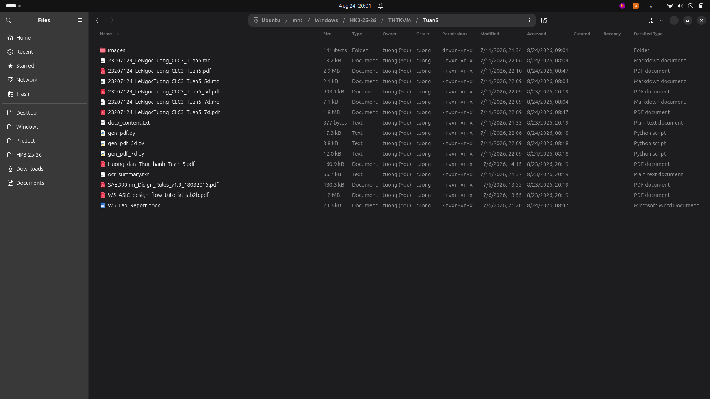
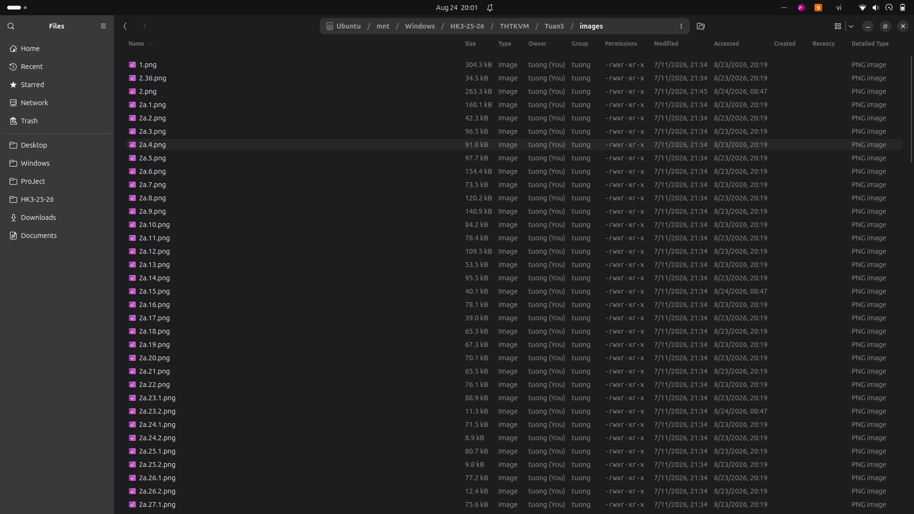
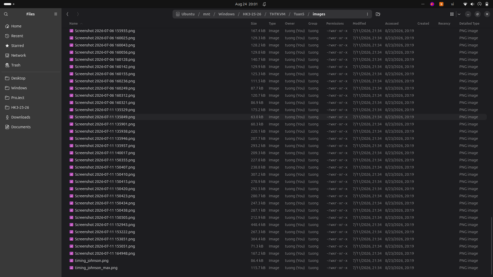
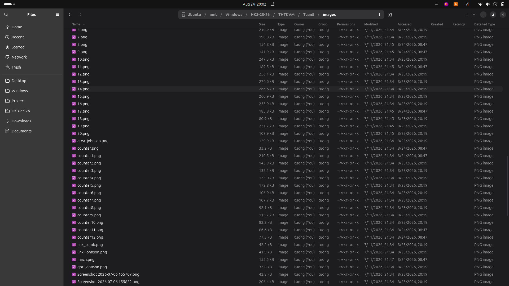

# Tuần 5: Bóc tách ký sinh RLC và Mô phỏng sau Layout (Post-layout Simulation)

Sinh viên: Lê Ngọc Tường (MSSV: 23207124, Lớp: 23DTV_CLC3)

## Nội dung thực hiện
- Bóc tách tham số điện trở, điện dung ký sinh (Parasitic Extraction - RLC) từ bản vẽ layout hoàn chỉnh.
- Thiết lập môi trường ADE để chạy mô phỏng sau layout (Post-layout Simulation).
- So sánh dạng sóng và độ trễ tín hiệu giữa mô phỏng trước và sau layout.
- Viết script Python tự động hóa để xuất và xử lý dữ liệu báo cáo.

## Danh mục tài liệu
- Script Python: gen_pdf.py, gen_pdf_5d.py, gen_pdf_7d.py.
- Báo cáo chi tiết: [BaoCao_ChiTiet_Tuan5.md](./BaoCao_ChiTiet_Tuan5.md) và các file PDF (23207124_LeNgocTuong_CLC3_Tuan5.pdf, bản 5d, 7d).
- Toàn bộ hơn 100 ảnh trích xuất ký sinh và dạng sóng lưu trong thư mục [Images_Goc/](./Images_Goc/).
- Tài liệu hướng dẫn: Huong_dan_Thuc_hanh_Tuan_5.pdf, SAED90nm_Disign_Rules_v1.9_18032015.pdf, W5_ASIC_design_flow_tutorial_lab2b.pdf.

## Hình ảnh minh họa

### Cấu hình mô phỏng Post-layout trong ADE

### Trích xuất linh kiện và thông số ký sinh

### Dạng sóng mô phỏng sau layout

### So sánh đáp ứng thời gian

